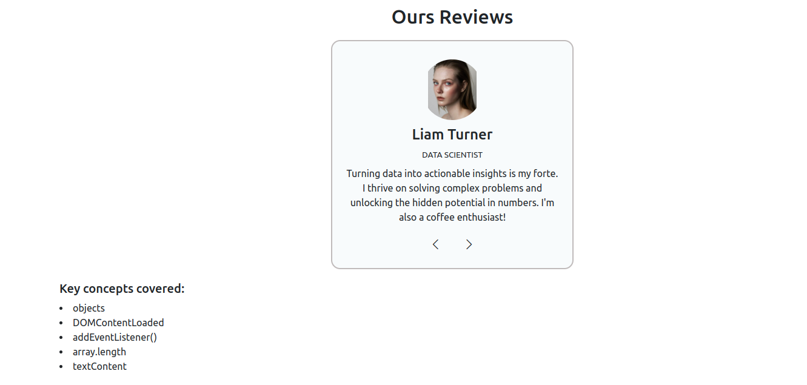
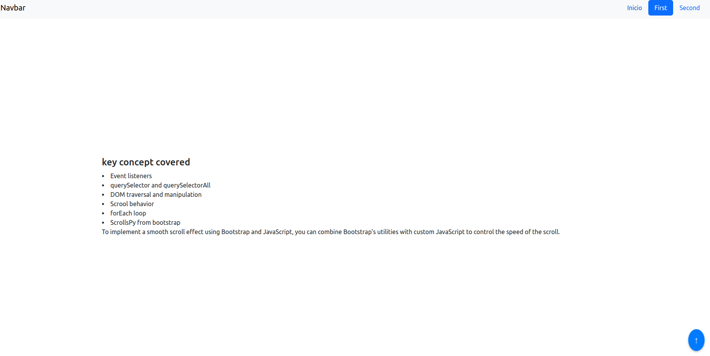

Here's an improved version of your README:

---

# JavaScript Projects

This repository showcases various practice projects using JavaScript, part of my journey in learning the language.  
> **"The best way to learn something is by doing it!"**

Each project focuses on different JavaScript concepts and practical use cases. I document my learnings and ideas in **Notion**, where I take detailed notes and track my progress. All will be implemented using Flask.

### Project Sources
The project ideas are primarily inspired by:
* [freeCodeCamp - JavaScript Projects for Beginners](https://www.freecodecamp.org/news/javascript-projects-for-beginners/#heading-how-to-create-a-review-carousel)
* [John Smilga's JavaScript Basic Projects Repository](https://github.com/john-smilga/javascript-basic-projects/tree/master)
- https://skillcrush.com/blog/projects-you-can-do-with-javascript/#chat
- https://www.geeksforgeeks.org/top-javascript-projects/
- https://www.100jsprojects.com/projects
- https://github.com/bradtraversy/50projects50days

> **"The best way to learn something new is by studying examples, replicating them, and analyzing the steps!"**

## Projects

### Reviews corousel

### Scrolling

